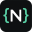
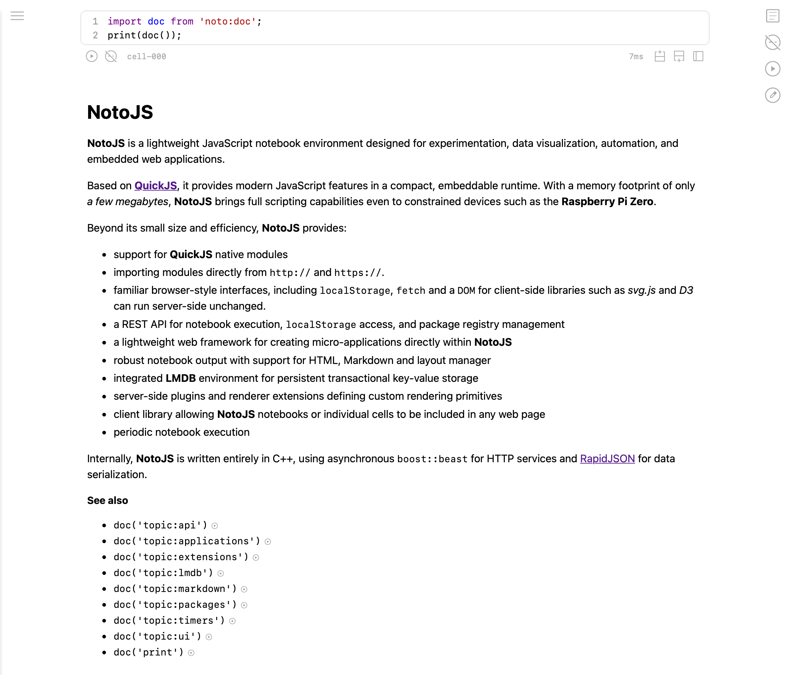
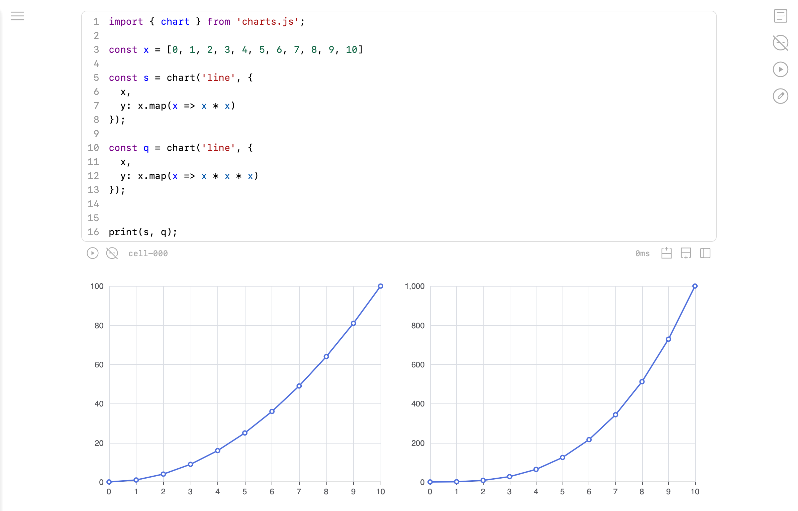
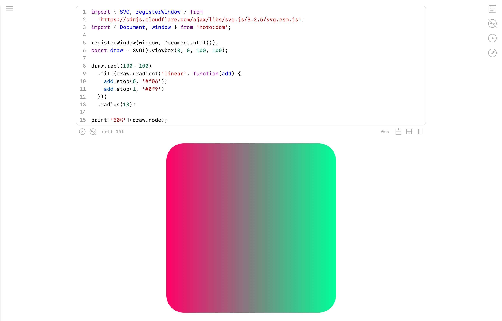

# NotoJS

**NotoJS** is a lightweight JavaScript notebook server built around [QuickJS](https://bellard.org/quickjs/). It provides an interactive notebook UI, a small HTTP API, persistent workspace storage, native C++ extension points, and server-side JavaScript execution in a compact C++ application.

## Repository layout

- `api/` Public C++ API headers and plugin CMake helper
- `app/` Main `notojs` executable and example `notojs.ini`
- `ext/` Optional native modules and plugins
- `lib/` **NotoJS** implementation and third-party submodules
- `test/` `boost::test` tests
- `tool/` Development tooling (built separately, not documented)

## Requirements

**NotoJS** is a C++17 CMake project. The top-level build expects:

- CMake 3.12+
- C++17 compiler
- Boost components: `filesystem`, `iostreams`, `process`, `program_options`, `url`
- OpenSSL
- Git submodules initialized

Optional dependencies:

- `libzip` for zip support
- `zlib` for gzip support

## Build

Clone with submodules:

```sh
git clone --recursive https://github.com/iapy/notojs.git
cd notojs
```

If the repository was cloned without submodules:

```sh
git submodule update --init --recursive
```

Configure and build:

```sh
cmake -S . -B build -DCMAKE_BUILD_TYPE=Release
cmake --build build
```

The main executable is built as:

```text
build/app/notojs
```

Run tests, if desired:

```sh
ctest --test-dir build
```

Install:

```sh
cmake --install build
```

The install step installs the executable to `bin` and the sample configuration to `etc` according to the active CMake install prefix.

## Quick start

The repository includes a minimal commented configuration at `app/notojs.ini`. Start the server with it:

```sh
build/app/notojs build/app/notojs.ini
```

Then open:

```text
http://127.0.0.1:8000/
```

## Installing documentation

The documentation is built as the `doc` shared library by the `lib/notojs/module/doc` CMake target. Build it together with the project, then point `[module:doc].suite` in your configuration at the generated library:

Linux:
```ini
[module:doc]
suite = /path/to/build/lib/notojs/module/doc/libdoc.so
```

MacOS
```ini
[module:doc]
suite = /path/to/build/lib/notojs/module/doc/libdoc.dylib
```

When configured, restart the server and open:

```text
http://127.0.0.1:8000/#doc
```

## Installing renderers

The built-in renderers are bundled JavaScript files built with the project:

```sh
cmake --build build --target charts tables
```

The generated bundles are:

```text
build/lib/notojs/bundle/render/charts.js
build/lib/notojs/bundle/render/tables.js
```

Copy them into the NotoJS JavaScript module search path configured by `[engine].jspath`, preserving their filenames:

```ini
[engine]
jspath = /usr/local/share/notojs/modules
```

```sh
cp -r build/lib/notojs/bundle/render/charts.js /usr/local/share/notojs/modules/charts.js
cp -r build/lib/notojs/bundle/render/tables.js /usr/local/share/notojs/modules/tables.js
```

After restarting NotoJS, notebooks that references these renderers can load `charts.js` and `tables.js` from the configured module path.

## Included extensions

- module `ext/crypto` — random bytes, hashing, HMAC, hex utilities.
- plugin `ext/inotify` — filesystem watcher plugin using FSEvents on macOS and inotify on Linux.

## Screenshots

### Documentation browser



### Charts



### SVG.js


