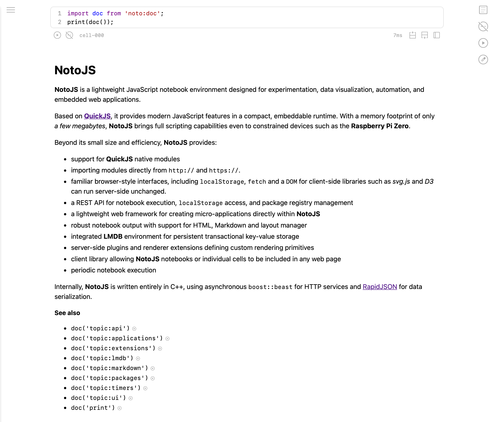
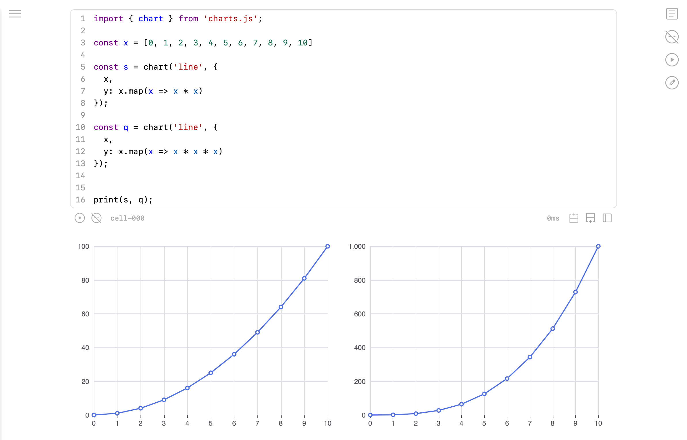
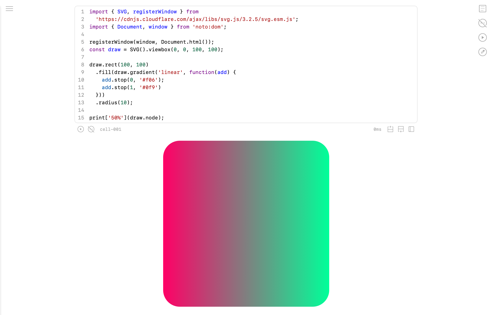

# NotoJS

**NotoJS** is a compact JavaScript notebook and application server built around [QuickJS](https://bellard.org/quickjs/). It combines an interactive browser UI with a server-side JavaScript runtime, persistent storage, Web-like APIs, document processing, and native extension points.

## Features

- **Interactive notebooks** — browser-based editing, cell execution, rich output, saved workspaces, and reusable library notebooks.
- **Server-side JavaScript** — a compact QuickJS runtime with ES modules, legacy scripts, asynchronous operations, and configurable module search paths.
- **Server-side DOM** — HTML and XML parsing and manipulation, DOM traversal, selectors, and styling APIs intended for libraries such as D3 and svg.js.
- **Web-like APIs** — `fetch`, `Request`, `Response`, `Headers`, `URL`, `URLSearchParams`, `Blob`, `File`, `FormData`, `TextEncoder`, `TextDecoder`, `atob`, and `btoa`.
- **Persistent storage** — a Web-like `Storage` API for JSON-serializable values, a configurable `localStorage` global, embedded LMDB databases, and persistent HTTP caching.
- **Sandboxed filesystem** — configurable read-only and read-write mounts exposed through virtual `Path` objects.
- **Rich rendering** — native HTML, Markdown, images, SVG, and XML output, plus bundled chart and table renderers.
- **Cryptography** — secure random generation, UUIDs, hashing, HMAC, hexadecimal conversion, Web Crypto-style globals, and encrypted LMDB-backed storage.
- **HTTP applications and API** — notebook-backed HTTP applications plus APIs for workspaces, execution results, storage, and package configuration.
- **Packages and automation** — local or remote JavaScript modules and scripts, cached package resolution, scheduled notebook execution, and configurable globalThis extenders.
- **Native extensibility** — a public C++ SDK for native modules and server plugins.

## Repository layout

- `app/` Main `notojs` executable and example `notojs.ini`
- `ext/` Optional native modules and plugins
- `lib/` **NotoJS** implementation and third-party submodules
- `sdk/` Public C++ API headers and plugin CMake helper
- `test/` `boost::test` tests
- `tool/` Development tooling (built separately, not documented)

## Requirements

**NotoJS** is a C++17 CMake project. The top-level build expects:

- CMake 3.12+
- C++17 compiler
- Boost components: `filesystem`, `iostreams`, `process`, `program_options`, `url`
- OpenSSL
- Git submodules initialized

Optional dependencies:

- `libzip` for zip support
- `zlib` for gzip support

## Build

Clone with submodules:

```sh
git clone --recursive https://github.com/iapy/notojs.git
cd notojs
```

If the repository was cloned without submodules:

```sh
git submodule update --init --recursive
```

Configure and build. Set `CMAKE_INSTALL_PREFIX` to the location where **NotoJS** should be installed; it defaults to a platform-dependent system prefix such as `/usr/local`:

```sh
cmake -S . -B build \
  -DCMAKE_BUILD_TYPE=Release \
  -DCMAKE_INSTALL_PREFIX=/usr/local
cmake --build build
```

The main executable is built as:

```text
build/app/notojs
```

Run tests, if desired:

```sh
ctest --test-dir build
```

## Install

Install the complete runtime using CMake's generated installation script:

```sh
cmake --install build
```

Use `sudo` when the selected prefix is not writable by the current user. The installation creates the following layout under `CMAKE_INSTALL_PREFIX`:

```text
bin/notojs                      NotoJS executable
etc/notojs.ini                  Generated configuration
lib/notojs/libdoc.so            Documentation suite
lib/notojs/stdlib/crypto.so     Standard native module
lib/notojs/stdlib/gzip.so       Optional, when zlib is available
lib/notojs/stdlib/yaml.so       YAML parser and emitter
lib/notojs/stdlib/zip.so        Optional, when libzip is available
lib/notojs/script/charts.js     Chart renderer
lib/notojs/script/tables.js     Table renderer
lib/notojs/plugin/              Server plugin directory
```

The generated `etc/notojs.ini` uses the configured installation prefix for the JavaScript module path, native module path, documentation suite, and plugin directory. No post-install copying or path editing is required.

## Quick start

Start the installed server with its generated configuration. For the `/usr/local` prefix shown above:

```sh
/usr/local/bin/notojs /usr/local/etc/notojs.ini
```

Then open:

```text
http://127.0.0.1:8000/
```

The default configuration binds only to `127.0.0.1:8000`. Copy or edit the installed configuration to set a workspace path, filesystem mounts, logging, plugins, or a different bind address.

## Documentation

The documentation suite is built and installed automatically as `lib/notojs/libdoc.so`. The generated configuration points `[module:doc].suite` to it. With the server running, open:

```text
http://127.0.0.1:8000/#doc
```

## Renderers

The `charts.js` and `tables.js` renderer bundles are built with the default build and installed automatically into `lib/notojs/script`, which the generated configuration sets as `[engine].jspath`.

For development without installing, the renderer targets can be rebuilt independently:

```sh
cmake --build build --target charts tables
```

Their build-tree outputs are:

```text
build/lib/notojs/bundle/render/charts.js
build/lib/notojs/bundle/render/tables.js
```

## Included extensions

- standard module `std/crypto` — random bytes, hashing, HMAC, and hex utilities; always installed as `crypto.so`.
- optional standard module `std/gzip` — gzip file support; installed as `gzip.so` when zlib is available.
- optional standard module `std/zip` — ZIP archive support; installed as `zip.so` when libzip is available.
- plugin `ext/inotify` — filesystem watcher plugin using FSEvents on macOS and inotify on Linux.

## Screenshots

### Documentation browser



### Charts



### SVG.js


